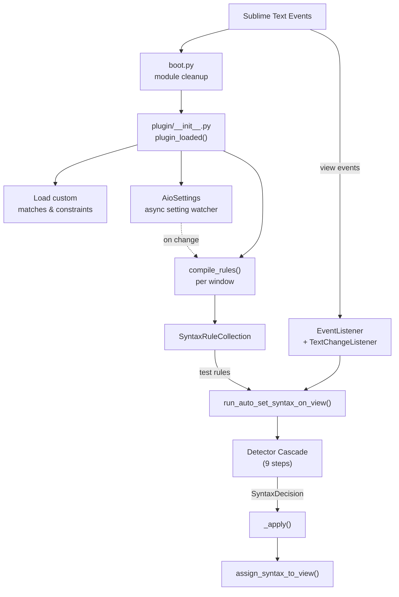
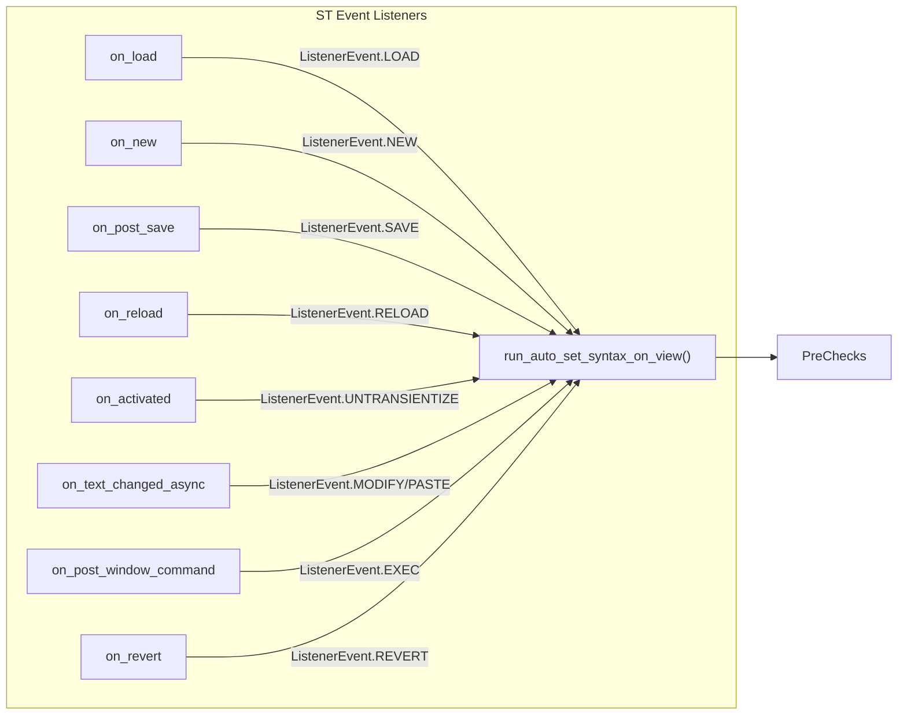
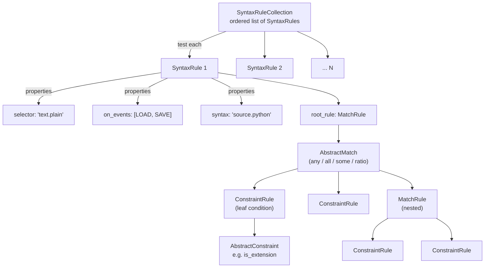
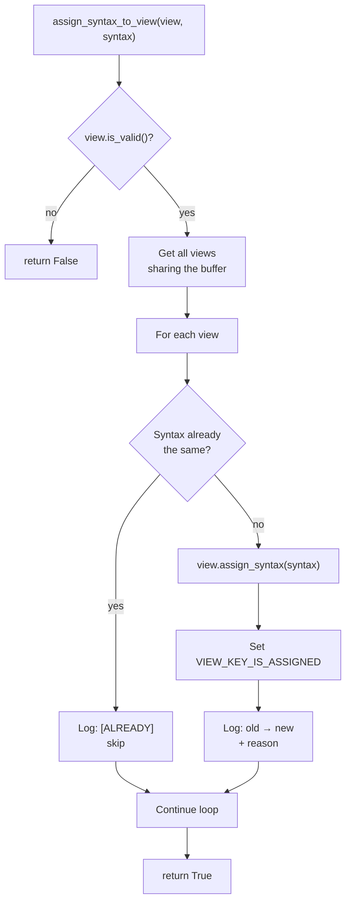

--8<-- "refs.md"

# How It Works

A Sublime Text 4 plugin that automatically detects and sets the correct syntax (language) for views using a cascading strategy pipeline — from user-defined rules through deep learning.

## Architecture Overview



## Entry Point & Lifecycle

### `boot.py`

Clears previously loaded plugin modules on reload, then imports `plugin/__init__.py`. This ensures a clean state during development.

### `plugin/__init__.py`

On `plugin_loaded()` (ST lifecycle hook):

1. Adds vendored Python lib path to `sys.path`
2. Loads custom implementations from `AutoSetSyntax-Custom/matches/` and `AutoSetSyntax-Custom/constraints/`
3. Sets up `AioSettings` — watches settings files asynchronously; recompiles rules on change
4. Calls `set_up_window()` for each open window — compiles rules, logs version info, checks Magika availability
5. Optionally runs syntax detection on startup views

On `plugin_unloaded()`:

- Tears down settings watchers and per-window state (log panels, rule collections)

## Trigger Events



All events converge on `run_auto_set_syntax_on_view()` in `plugin/commands/auto_set_syntax.py`.

### Per-Event Behavior Detail

| Event            | Listener                  | Trigger                    | Notes                     |
| ---------------- | ------------------------- | -------------------------- | ------------------------- |
| `LOAD`           | `on_load`                 | File opened                | Marks transient state     |
| `NEW`            | `on_new`                  | New untitled file          |                           |
| `SAVE`           | `on_post_save`            | After save                 |                           |
| `RELOAD`         | `on_reload`               | File reloaded              |                           |
| `UNTRANSIENTIZE` | `on_activated`            | Preview → permanent        | Only fires once per view  |
| `MODIFY`         | `on_text_changed_async`   | Typing in first/last lines | Debounced, plaintext only |
| `PASTE`          | `on_text_changed_async`   | Large text insertion       | Plaintext only            |
| `EXEC`           | `on_post_window_command`  | Build output panel         |                           |
| `REVERT`         | `on_revert`               | File reverted              |                           |
| `COMMAND`        | `auto_set_syntax` command | Manual trigger             |                           |
| `INIT`           | Startup views             | Plugin load                |                           |

### Prerequisites (pre-flight checks)

Before any detector runs, the pipeline verifies:

1. View has a window and is valid
2. View is "syntaxable" — not a widget/panel, not transient, within size limit
3. View is plaintext (if `must_plaintext=True`)
4. `SyntaxRuleCollection` is compiled for the window
5. Plugin is ready (`G.is_plugin_ready()`)

## The Detector Pipeline (9 Steps)

The pipeline tries each detector in order, stopping at the first one to reach a decision:

1. **Exec Output** — `exec_file_syntax` for build panels
2. **New File** — `new_file_syntax` for untitled files
3. **ST Syntax Test** — the syntax named on an ST syntax test file's first line
4. **Plugin Rules** — iterate user-defined `SyntaxRule` collection
5. **First Line** — shebang (`#!/usr/bin/env`) or modeline (`-*- mode -*-`)
6. **Trimmed Filename** — strip suffixes and match the base filename
7. **Magika (DL)** — Google's deep-learning content-type detection
8. **Heuristics** — content-based guess (currently JSON detection)
9. **Give Up** — leave as plain text

A detector never touches the view. It inspects the `ViewSnapshot` and returns either a
`SyntaxDecision` or `None`:

```python
@dataclass(slots=True, frozen=True)
class SyntaxDecision:
    syntax: sublime.Syntax          # what to assign
    details: dict[str, Any]         # why — logged verbatim
    status_message: str | None      # optional status bar text, shown when applied
```

Steps 1 and 2 are early-outs handled directly by `run_auto_set_syntax_on_view()` — exec output
runs *before* the (comparatively expensive) `ViewSnapshot` is built, since a build panel updates
often and needs none of it. Steps 3–8 form the `_detect()` chain. Whatever the source, the
resulting decision reaches the view through a single `_apply()` call, which emits any
`status_message` and hands off to `assign_syntax_to_view()`.

## Rules System

The rules system is a tree of `SyntaxRule` objects, each containing a nested match/constraint tree.



### SyntaxRule

The top-level rule configured in settings:

```json
{
  "comment": "Python files",
  "syntaxes": ["Python", "scope:source.python"],
  "selector": "text.plain",
  "on_events": ["LOAD", "SAVE"],
  "match": {
    "match": "all",
    "rules": [
      { "constraint": "is_extension", "args": [".py"] }
    ]
  }
}
```

Fields:

- **`syntax`** / **`syntaxes`**: The target syntax to assign
- **`selector`**: Scope filter — only applies if current scope matches (default: `text.plain`)
- **`on_events`**: Restrict which events trigger this rule (`None` = all events)
- **`root_rule`**: A `MatchRule` (the match/constraint tree)
- **`comment`**: Human-readable label (for logging/debugging)
- **`src_setting`**: Reference back to the original setting object

### MatchRule + AbstractMatch

A `MatchRule` combines a match strategy (`AbstractMatch`) with child rules:

| Match        | Behavior                     | Droppable When           |
| ------------ | ---------------------------- | ------------------------ |
| `any`        | At least one child passes    | No child rules           |
| `all`        | Every child passes           | No child rules           |
| `some(n)`    | At least `n` children pass   | `n` > number of children |
| `ratio(n/d)` | At least `n` out of `d` pass | Bad ratio parameters     |

Children can be `ConstraintRule` (leaf) or nested `MatchRule` (sub-tree).

### ConstraintRule + AbstractConstraint

A `ConstraintRule` wraps an `AbstractConstraint` with optional inversion:

| Constraint                                            | What It Checks                       |
| ----------------------------------------------------- | ------------------------------------ |
| `is_extension`                                        | File extension matches               |
| `is_name`                                             | Filename matches                     |
| `contains` / `contains_regex`                         | Content contains text / regex        |
| `first_line_contains` / `first_line_contains_regex`   | First line matches                   |
| `is_syntax`                                           | Current syntax matches               |
| `is_size`                                             | File size within range               |
| `is_line_count`                                       | Line count within range              |
| `is_interpreter`                                      | Shebang interpreter matches          |
| `is_hidden_syntax`                                    | Syntax is a hidden/private syntax    |
| `is_platform` / `is_platform_arch`                    | OS / architecture matches            |
| `is_arch`                                             | CPU architecture matches             |
| `is_in_git_repo` / `is_in_hg_repo` / `is_in_svn_repo` | VCS repository check                 |
| `is_in_python_django_project`                         | Django project check                 |
| `is_in_ruby_on_rails_project`                         | Rails project check                  |
| `is_magika_enabled`                                   | Magika availability check            |
| `name_contains` / `name_contains_regex`               | Filename substring / regex           |
| `path_contains` / `path_contains_regex`               | Full path substring / regex          |
| `relative_exists`                                     | Relative path/file exists in project |
| `selector_matches`                                    | Scope selector matches               |

### Optimization

At compile time, the rule tree is optimized — rules that *fold* (their result no longer depends
on runtime data, so they'd evaluate to the same thing on every view) are pruned so they aren't
re-tested on every view.

Every node answers one question, `fold()`, returning the constant it always evaluates to or
`None` when the result still depends on the view:

```
SyntaxRule.fold()     → False if no syntax, no events (and not unrestricted), or no root_rule
MatchRule.fold()      → the match's own fold, e.g. some(5) with 3 children is a constant False
ConstraintRule.fold() → the constraint's fold, flipped by `inverted`
```

Knowing *which* constant a rule folds to is the whole point: an empty `all` is always `True`
(`all([]) == True`) while an empty `any` is always `False` (`any([]) == False`), and they are
not interchangeable. `prunable_child_value()` tells a parent match which of those two values is
safe to silently remove from its own child list without changing its result:

- Dropping a constant-`True` child from `all(...)` is safe (`True` is AND's identity element:
  `all(True, x) == all(x)`), but dropping a constant-`False` child is not — the whole `all(...)`
  must become `False` instead, since `all(False, x)` is always `False` regardless of `x`.
- The mirror is true for `any`: dropping constant-`False` is safe, constant-`True` is not.
- `ratio(n/d)`'s `prunable_child_value()` is `None` — its goal (`ceil(ratio * len(rules))`)
  depends on the *count* of its children, so no child, constant or not, can ever be safely
  removed without shifting that goal.

Dropped rules are logged and stored in `G.dropped_rules_collection` for debugging.

## ViewSnapshot

Before the detector chain runs, a `ViewSnapshot` is created — a frozen snapshot of the view's state at that moment. It is everything a detector is allowed to know about the view:

- **`view`**: The `sublime.View` object
- **`content`**: Full text content
- **`first_line`**: First line of content
- **`char_count`**, **`line_count`**: Size metrics
- **`path_obj`**: `Path()` object (or `None` if unsaved)
- **`file_extensions`**: List of suffixes (e.g., `.tar.gz` → `['.tar', '.gz']`)
- **`file_name`**, **`file_name_unhidden`**: With/without leading dot
- **`syntax`**: Current syntax object
- **`encoding`**: Encoding (defaults to UTF-8 for unsaved buffers)
- **`caret_rowcol`**: Cursor position `(row, col)` for edit-aware decisions
- **`content_bytes`**, **`encoding_py`**: Lazy-computed derivatives

## Final Assignment

`_apply()` is the only place a decision reaches the view. It is a no-op when no detector decided,
emits the decision's `status_message` if it carries one, then delegates to
`assign_syntax_to_view()`:



1. Validates the view
2. Gets all sibling views sharing the same buffer (via `view.buffer().views()`), so clones and
   split views stay in sync
3. For each view: skips if already has the target syntax, otherwise calls `view.assign_syntax(syntax)`
4. Sets `VIEW_KEY_IS_ASSIGNED` on view settings
5. Logs the change with full context (old syntax → new syntax + the decision's `details`)

## Extensibility

Users can add custom `AbstractMatch` or `AbstractConstraint` implementations:

1. Create a Python file in `Packages/AutoSetSyntax-Custom/matches/` or `Packages/AutoSetSyntax-Custom/constraints/`
2. Subclass `AbstractMatch` or `AbstractConstraint`
3. Implement `test()` (and optionally `fold()`)
   - `fold()` returns the constant `test()` would always return, or `None` when the result still
     depends on the view. Both constants are expressible, so an "always matches" implementation
     reports `True` and an "always fails" one reports `False` — getting this backwards inverts
     the rule's meaning.
   - For `AbstractMatch`, also override `prunable_child_value()` if the match supports safely
     pruning individual children (see [Optimization](#optimization)); the default of "only a
     constant-`False` child is prunable" is right for `any`-like combinators but wrong for
     `all`-like ones.

!!! warning "Breaking change for existing Custom Implementations"

    `fold()` replaces `is_droppable()`, `droppable_value()` and `AbstractMatch.is_droppable()`.
    A custom implementation still overriding those names keeps working, but silently stops
    being optimized away — AutoSetSyntax logs a warning naming the class at startup. To
    migrate, return `False` where you returned `is_droppable() == True`, and `None` where you
    returned `False`.
4. The class name convention determines the setting name: `FooBarMatch` → `"foo_bar"` and `BazConstraint` → `"baz"`

Auto-discovered at plugin load via `_load_custom_implementations()` using `pkgutil.iter_modules()`.

## Magika Integration

Magika (Google's deep-learning file type detector) is an optional dependency:

```python
def get_magika_object() -> magika.Magika | None:
    try:
        from magika import Magika
        from magika import PredictionMode
    except ImportError:
        return None
    return Magika(prediction_mode=PredictionMode.HIGH_CONFIDENCE)
```

- Downloaded separately; not vendored
- Uses `HIGH_CONFIDENCE` prediction mode (avoids false positives)
- Only invoked for extensionless plaintext files (unless triggered via command)
- Results mapped to ST syntaxes via `magika.syntax_map` settings

## Settings

Uses `AioSettings` — an async settings watcher that:

- Merges per-project settings with plugin defaults
- Automatically recompiles rule collections when settings change
- Tracks per-window settings independently

Key settings groups:

- **Strategy control**: `new_file_syntax`, `exec_file_syntax`, `trim_suffixes`, `magika.*`
- **Behavior**: `debounce`, `run_on_startup_views`, `enable_log`
- **Rules**: `syntax_rules` — the array of user-defined `SyntaxRule` objects

## Shared Global State

```python
@dataclass
class _GlobalState:
    startup_views: set[sublime.View]         # Views existing at startup
    syntax_rule_collections: WindowKeyedDict  # Per-window compiled rules
    dropped_rules_collection: WindowKeyedDict # Per-window optimized-away rules
```

`G = _GlobalState()` — a single shared instance holding per-window compiled state.
